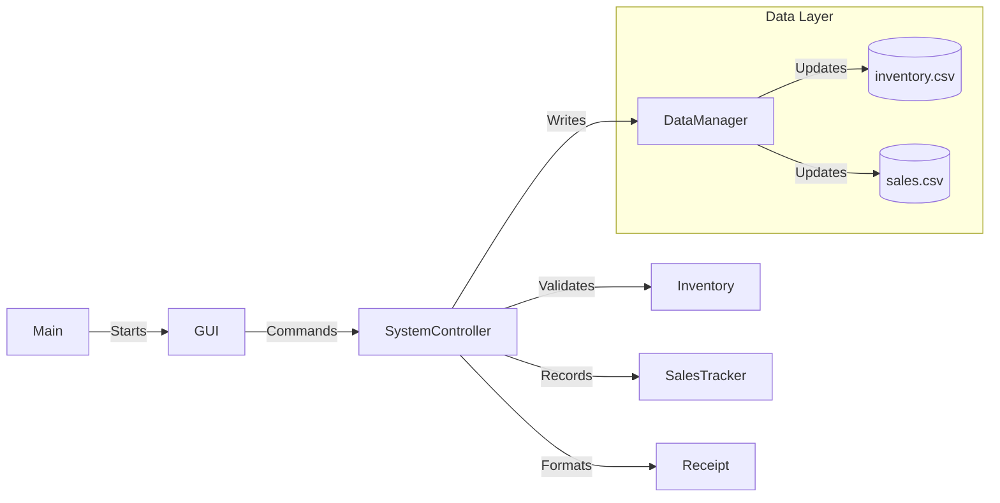

# 🏛️ Supermarket POS: Team Discussion & Deep Dive Guide

*This document is strictly for the development team. It details the internal logic and "gotchas" to ensure every member can confidently explain and modify the system during project discussions.*

---

## 🎯 System Core Logic: How the Pieces Connect

The entire project is built on the **Facade Pattern** (via `SystemController`). The GUI never talks to the Inventory or the Cart directly. It only talks to the Controller.

### 1. The Inventory Lifecycle (`Inventory.java`)
- **Internal Storage**: Uses an `ArrayList<Item>`.
- **Search Logic**: Every time we add an item, we search the ID. If it exists, we **increment quantity** instead of creating a duplicate. This prevents ID collisions.
- **Discussion Point**: "What happens if we enter a duplicate ID with different details?" -> Currently, the system assumes the ID is the source of truth and only updates the quantity.

### 2. The Shopping Process (`Cart.java` & `CartItem.java`)
- **Temporary State**: Items in the `Cart` **do not** affect the `Inventory` until the moment the "Checkout" button is pressed.
- **Stock Validation**: When a user adds an item to the cart, the `SystemController` checks if `requestedQty <= availableQty`.
- **Discussion Point**: "If two customers buy the same thing, how do we handle it?" -> In this single-user system, the check happens at the moment of adding to the cart and again at checkout.

### 3. The Financial Engine (`Receipt.java`)
- **Responsibility**: Takes the list of `CartItem` objects and turns them into a formatted String.
- **Tax Logic**: Static 14% calculation.
- **Formatting**: Uses `String.format` to ensure prices always show two decimal places (e.g., `$10.00`).

---

## 💾 Data Persistence Deep Dive (`DataManager.java`)

We aren't using a database, so we "serialize" our Java objects into text lines in a CSV.

### File Formats:
- **`inventory.csv`**: `ID,Name,Category,Price,Quantity`
- **`sales.csv`**: `TotalRevenue,TotalItemsSold`

### Critical Flow:
1.  **Loading**: Happens once at startup in `Main.java`. `DataManager` parses strings back into `Item` objects.
2.  **Saving**: Happens **after every checkout** and **after every restock**. This ensures that even if the power goes out, the latest stock and sales are saved.

---

## 🖥️ Graphical Interface Logic (`SupermarketGUI.java`)

### Button Action Breakdown:
- **`View Inventory`**: Clears the display area and loops through `controller.getAllInventoryItems()`.
- **`Add to Cart`**: Triggers two pop-up dialogs (`JOptionPane`). It validates that the input is a number before passing it to the controller.
- **`Checkout`**: This is the "Big Button". It:
    1.  Tells the controller to finalize sales.
    2.  Updates the `displayArea` with the final receipt.
    3.  Automatically refreshes the persistent CSV files.

---

## 🛠️ Discussion Guide: Q&A for the Team

### Q1: How do we add a "Discount" feature?
> **Answer**: We would modify `Receipt.java` to accept a discount percentage and `Cart.java` to apply it to the subtotal before tax.

### Q2: How does the system handle "Invalid Input" (e.g., typing "abc" for price)?
> **Answer**: The GUI uses `try-catch` blocks around `Double.parseDouble()` and `Integer.parseInt()`. If a user types text where a number should be, a "Invalid Input!" error message appears.

### Q3: Where is the "Real" stock updated?
> **Answer**: Only in the `processCheckout()` method in `SystemController`. Adding to cart is just a "preview".

---

## 🔗 Internal Relationship Map

---
*End of Discussion Guide*
